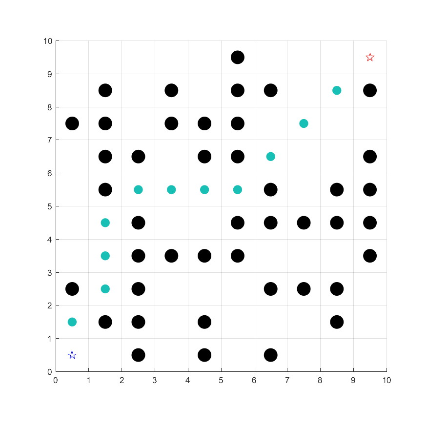

# An matlab implementation of 2D A* algorithm
An matlab implementation of 2D A* algorithm，more details can be found at 
+ https://mesywang.github.io/2020/01/23/Dijkstra-and-Astar/

---

RUN **main.m**，the results are as follows. The probability of obstacle occurrence can be achieved by changing the value of "obstacle_ratio" in obstacle_map.m 

	

