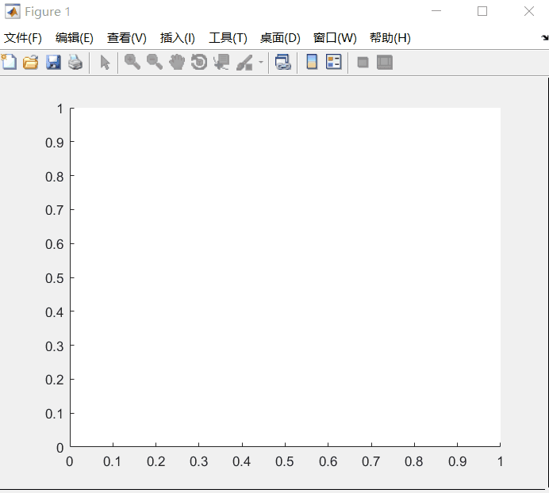

# Motion-Planning-Algorithm
Matlab Implementations of some motion planning algorithms, such as A*, RRT, RRT*, minimum snap trajectory generation and so on...

---

## [Astar](http://wiki.ros.org/kinetic/Installation/Ubuntu)

 Astar

	

## RRT

 RRT 

	

## RRTstar

 RRT* 

	

## Minimun Snap Trajectory Generator

 Minimum Snap Trajectory

	

## Hard Constraint Trajectory Optimization

 Corridor-based and BezierCurve-based Trajectory

	

